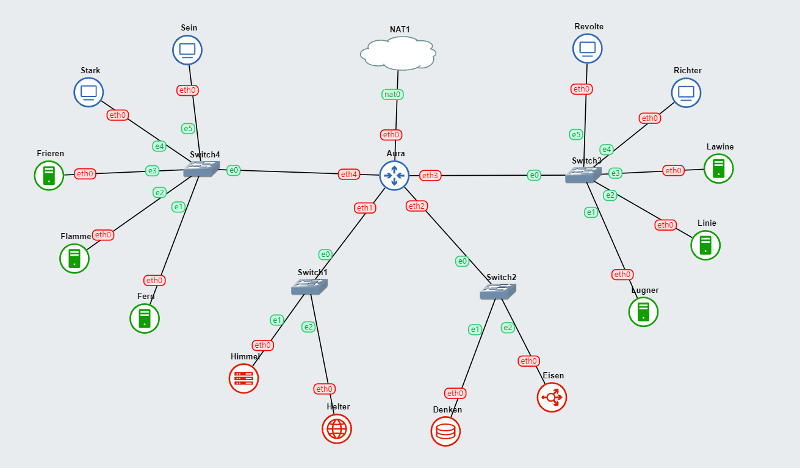
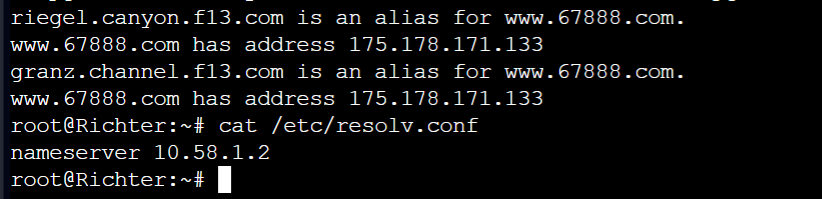
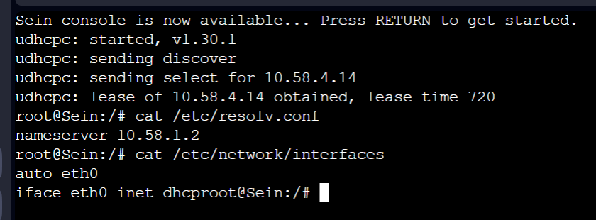

# Jarkom-Modul-3-F13-2022

| **No** | **Nama**                         | **NRP**    |
| ------ | -------------------------------- | ---------- |
| 1      | Helmi Abiyu Mahendra             | 5025211061 |
| 2      | Muhammad Naufal Fawwaz Ramadhan  | 5025211223 |


--------------------------------
## Topologi



### Netwok Configuration

Router:
* Aura (Router/DHCP Relay):
```sh
auto eth0
iface eth0 inet dhcp

auto eth1
iface eth1 inet static
	address 10.58.1.0
	netmask 255.255.255.0

auto eth2
iface eth2 inet static
	address 10.58.2.0
	netmask 255.255.255.0

auto eth3
iface eth3 inet static
	address 10.58.3.0
	netmask 255.255.255.0
auto eth4
iface eth4 inet static
	address 10.58.4.0
	netmask 255.255.255.0
```

Switch 1
* Himmel (DHCP Server):
```sh
auto eth0
iface eth0 inet static
  address 10.58.1.1
  netmask 255.255.255.0
  gateway 10.58.1.0   
```

* Heiter (DNS Server):
```sh
auto eth0
iface eth0 inet static
  address 10.58.1.2
  netmask 255.255.255.0
  gateway 10.58.1.0   
```

Switch2
* Denken (Database Server):
```sh
auto eth0
iface eth0 inet static
  address 10.58.2.1
  netmask 255.255.255.0
  gateway 10.58.2.0   
```

* Eisen (Load Balancer):
```sh
auto eth0
iface eth0 inet static
  address 10.58.2.2
  netmask 255.255.255.0
  gateway 10.58.2.0   
```

Switch3
* Revolte & Richter (Client):
```sh
auto eth0
iface eth0 inet dhcp 
```

* Lugner (Laravel Worker):
```sh
auto eth0
iface eth0 inet static
  address 10.58.3.1
  netmask 255.255.255.0
  gateway 10.58.3.0  
```

* Lawine (Laravel Worker):
```sh
auto eth0
iface eth0 inet static
  address 10.58.3.3
  netmask 255.255.255.0
  gateway 10.58.3.0  
```

* Linie (Laravel Worker):
```sh
auto eth0
iface eth0 inet static
  address 10.58.3.2
  netmask 255.255.255.0
  gateway 10.58.3.0  
```

Switch4
* Sein &  Stark (Client):
```sh 
auto eth0
iface eth0 inet dhcp
```

* Frieren (PHP Worker):
```sh 
auto eth0
iface eth0 inet static
  address 10.58.4.3
  netmask 255.255.255.0
  gateway 10.58.4.0  
```

* Flamme (PHP Worker):
```sh 
auto eth0
iface eth0 inet static
  address 10.58.4.2
  netmask 255.255.255.0
  gateway 10.58.4.0  
```

* Fern (PHP Worker):
```sh 
auto eth0
iface eth0 inet static
  address 10.58.4.1
  netmask 255.255.255.0
  gateway 10.58.4.0  
```
## Soal 0
* Setup
seluruh node menjalan kan
```sh
echo nameserver 192.168.122.1
```

## Soal 1

> Setelah mengalahkan Demon King, perjalanan berlanjut. Kali ini, kalian diminta untuk melakukan register domain berupa `riegel.canyon.f04.com` untuk worker Laravel dan `granz.channel.f04.com` untuk worker PHP (0) mengarah pada worker yang memiliki IP `192.223.x.1`.


1. Konfigurasi pada Heiter (DNS Server)
...


* `update n instalasi bind9`:
```sh
apt-get update
apt-get install bind9 -y
```
* `/etc/bind/named.conf.local`:
```sh
zone "riegel.canyon.f13.com" {
        type master;
        file "/etc/bind/jarkom/riegel.canyon.f13.com";
};

zone "granz.channel.f13.com" {
        type master;
        file "/etc/bind/jarkom/granz.channel.f13.com";
};
```
2. Pembuatan directory jarkom
```sh
mkdir /etc/bind/jarkom
```

3. File riegel & granz
```sh
##/etc/bind/granz/riegel.canyon.f04.com
;
; BIND data file for local loopback interface
;
$TTL    604800
@       IN      SOA     riegel.canyon.f13.com. root.riegel.canyon.f13.com. (
                        2023111301      ; Serial
                        604800          ; Refresh
                        86400           ; Retry
                        2419200         ; Expire
                        604800 )        ; Negative Cache TTL
;
@               IN      NS      riegel.canyon.f13.com.
@               IN      A       10.58.4.1 ; IP Fern Laravel Workerr' 
> /etc/bind/jarkom/riegel.canyon.f13.com


##/etc/bind/granz/granz.channel.f04.com
;
; BIND data file for local loopback interface
;
$TTL    604800
@       IN      SOA     granz.channel.f13.com.  root.granz.channel.f13.com.  (
                        2023111301      ; Serial
                        604800          ; Refresh
                        86400           ; Retry
                        2419200         ; Expire
                        604800 )        ; Negative Cache TTL
;
@               IN      NS      granz.channel.f13.com.
@               IN      A       10.58.3.1 ; IP Lugner PHP Worker' 
```

4. Perubahan file /etc/bind/named.conf.options
```sh
options {
        directory "/var/cache/bind";

        forwarders {
                192.168.122.1;
        };

        // dnssec-validation auto;
        allow-query{any;};
        auth-nxdomain no;    # conform to RFC1035
        listen-on-v6 { any; };
};
```
5. Restart bind9:
```sh
service bind9 restart
`````



## Soal 2
 > Client yang melalui Switch3 mendapatkan range IP dari 192.223.3.16 - 192.223.3.32 dan 192.223.3.64 - 192.223.3.80


1. tambahkan konfigurasi range ip pada `/etc/dhcp/dhcpd.conf` on `Himmel`

* `/etc/dhcp/dhcpd.conf`:
```sh
echo 'subnet 10.58.1.0 netmask 255.255.255.0 {
}

subnet 10.58.2.0 netmask 255.255.255.0 {
}

subnet 192.212.3.0 netmask 255.255.255.0 {
        range 10.58.3.16 10.58.3.32;
        range 10.58.3.64 10.58.3.80;
        option routers 10.58.3.0;

}' > /etc/dhcp/dhcpd.conf

service isc-dhcp-server restart
service isc-dhcp-server status

```

## Soal 3

> Client yang melalui Switch4 mendapatkan range IP dari 192.223.4.12 - 192.223.4.20 dan 192.223.4.160 - 192.223.4.168


1. add ip range configuration in `/etc/dhcp/dhcpd.conf` on `Himmel`

* `/etc/dhcp/dhcpd.conf`:
```sh
    echo 'subnet 10.58.1.0 netmask 255.255.255.0 {
}

subnet 10.58.2.0 netmask 255.255.255.0 {
}

subnet 192.212.3.0 netmask 255.255.255.0 {
        range 10.58.3.16 10.58.3.32;
        range 10.58.3.64 10.58.3.80;
        option routers 10.58.3.0;
}

subnet 10.58.4.0 netmask 255.255.255.0 {
        range 10.58.4.12 10.58.4.20;
        range 10.58.4.160 10.58.4.168;
        option routers 10.58.4.0;
}' > /etc/dhcp/dhcpd.conf
```

## Soal 4

> Client mendapatkan DNS dari Heiter dan dapat terhubung dengan internet melalui DNS tersebut


1. tambahkan konfigurasi DNS pada `/etc/dhcp/dhcpd.conf` di `Himmel` menuju `Heiter`

* `/etc/dhcp/dhcpd.conf`:
```sh
echo 'subnet 10.58.1.0 netmask 255.255.255.0 {
}

subnet 10.58.2.0 netmask 255.255.255.0 {
}

subnet 192.212.3.0 netmask 255.255.255.0 {
        range 10.58.3.16 10.58.3.32;
        range 10.58.3.64 10.58.3.80;
        option routers 10.58.3.0;
        option broadcast-address 10.58.3.255;
        option domain-name-servers 10.58.1.2;
}

subnet 10.58.4.0 netmask 255.255.255.0 {
        range 10.58.4.12 10.58.4.20;
        range 10.58.4.160 10.58.4.168;
        option routers 10.58.4.0;
        option broadcast-address 10.58.4.255;
        option domain-name-servers 10.58.1.2;
}' > /etc/dhcp/dhcpd.conf
```
    
## Soal 5

> Lama waktu DHCP server meminjamkan alamat IP kepada Client yang melalui Switch3 selama 3 menit sedangkan pada client yang melalui Switch4 selama 12 menit. Dengan waktu maksimal dialokasikan untuk peminjaman alamat IP selama 96 menit


1. add lease time configuration in `/etc/dhcp/dhcpd.conf` on `Himmel`

* `/etc/dhcp/dhcpd.conf`:
```sh
echo 'subnet 10.58.1.0 netmask 255.255.255.0 {
}

subnet 10.58.2.0 netmask 255.255.255.0 {
}

subnet 192.212.3.0 netmask 255.255.255.0 {
        range 10.58.3.16 10.58.3.32;
        range 10.58.3.64 10.58.3.80;
        option routers 10.58.3.0;
        option broadcast-address 10.58.3.255;
        option domain-name-servers 10.58.1.2;
        default-lease-time 180;
        max-lease-time 5760;
}

subnet 10.58.4.0 netmask 255.255.255.0 {
        range 10.58.4.12 10.58.4.20;
        range 10.58.4.160 10.58.4.168;
        option routers 10.58.4.0;
        option broadcast-address 10.58.4.255;
        option domain-name-servers 10.58.1.2;
        default-lease-time 720;
        max-lease-time 5760;
}' > /etc/dhcp/dhcpd.conf

service isc-dhcp-server restart
service isc-dhcp-server status
```

2. Juga konfigurasi pada node Aura
```sh
apt-get update
apt-get install isc-dhcp-relay -y
service isc-dhcp-relay start

echo '
SERVERS="10.58.1.1"
INTERFACES="eth1 eth2 eth3 eth4"
OPTIONS=""' > /etc/default/isc-dhcp-relay

echo 'net.ipv4.ip_forward=1' > /etc/sysctl.conf

service isc-dhcp-relay restart
```



    
    
## Soal 6

> Pada masing-masing worker PHP, lakukan konfigurasi virtual host untuk website berikut dengan menggunakan php 7.3.


Pada tiap PHP worker:

1. install `nginx php php-fpm`
...

* download dan unzip file dengan command berikut:
    ```sh
   
    ```
* `/etc/nginx/sites-available/granz.channel.f04`:
    ```sh

    ```
    
## Soal 7

> Kepala suku dari Bredt Region memberikan resource server sebagai berikut: <br>
> a. Lawine, 4GB, 2vCPU, dan 80 GB SSD. <br>
> b. Linie, 2GB, 2vCPU, dan 50 GB SSD. <br>
> c. Lugner 1GB, 1vCPU, dan 25 GB SSD. <br>
> aturlah agar Eisen dapat bekerja dengan maksimal, lalu lakukan testing dengan 1000 request dan 100 request/second.


Untuk melakukan testing, kita dapat menggunakan `ApacheBench`. berikut adalah langkah-langkahnya:

Pada salah satu client:

1. install `apache2-utils`

#### hasil:


    
## Soal 8

> Karena diminta untuk menuliskan grimoire, buatlah analisis hasil testing dengan 200 request dan 10 request/second masing-masing algoritma Load Balancer dengan ketentuan sebagai berikut: <br>
> a. Nama Algoritma Load Balancer <br>
> b. Report hasil testing pada Apache Benchmark <br>
> c. Grafik request per second untuk masing masing algoritma. <br>
> d. Analisis 


Sebelum melakukan testing algoritma load balancing, kita perlu meng-setup load balancer terlebih dahulu:

Pada `Eisen`:

1. install `nginx`


Untuk melakukan testing, kita dapat menggunakan `ApacheBench`. berikut adalah langkah-langkahnya:

Pada salah satu client:

1. install `apache2-utils`


#### Hasil: 
    
## Soal 9

> Dengan menggunakan algoritma Round Robin, lakukan testing dengan menggunakan 3 worker, 2 worker, dan 1 worker sebanyak 100 request dengan 10 request/second, kemudian tambahkan grafiknya pada grimoire.
 

Untuk melakukan testing, kita dapat menggunakan `ApacheBench`. berikut adalah langkah-langkahnya:

Pada salah satu client:

1. install `apache2-utils`


#### Hasil: 

    
## Soal 10

> Selanjutnya coba tambahkan konfigurasi autentikasi di LB dengan dengan kombinasi username: `netics` dan password: `ajkf04`, dengan yyy merupakan kode kelompok. Terakhir simpan file `htpasswd` nya di `/etc/nginx/rahasisakita/` .
 

Pada Eisen:

1. buat directory baru `/etc/nginx/rahasiakita/`


* `/etc/nginx/sites-available/lb-jarkom`:
    ```sh
   
    ```

#### Hasil: 


    
## Soal 11

> Lalu buat untuk setiap request yang mengandung `/its` akan di proxy passing menuju halaman `https://www.its.ac.id`.
 

Pada Eisen:

1. konfigurasi `/etc/nginx/sites-available/lb-jarkom` 

* `/etc/nginx/sites-available/lb-jarkom`:
    ```sh

    ```

#### Hasil: 


## Soal 12

> Selanjutnya LB ini hanya boleh diakses oleh client dengan IP `192.223.3.69`, `192.223.3.70`, `192.223.4.167`, dan `192.223.4.168`.
 

Pada Eisen:

1. konfigurasi `/etc/nginx/sites-available/lb-jarkom` 

* `/etc/nginx/sites-available/lb-jarkom`:
    ```sh

    
    ```

#### Hasil: 


## Soal 13 & 14

> Karena para petualang kehabisan uang, mereka kembali bekerja untuk mengatur `riegel.canyon.f04.com`.
> 1. Semua data yang diperlukan, diatur pada Denken dan harus dapat diakses oleh `Lawine`, `Linie`, dan `Lugner`. (13)
> 2. `Lawine`, `Linie`, dan `Lugner` memiliki Riegel Canyon sesuai dengan quest guide berikut. Jangan lupa melakukan instalasi `PHP8.0` dan `Composer` (14)

Pada `Danken`

1. tambakan `nameserver 192.223.1.3 # IP Heiter` pada `/etc/resolv.conf`


* `queries.sql`:
    ```sql
   
    ```

* `/etc/mysql/my.cnf`:
    ```sh

    ```

Pada `Lawine`, `Linie`, dan `Lugner`:

Untuk setup Laravel:

1. install `mariadb-client`, `php8.0`, `git`, dan `composer`


* `.env`:
    ```sh
    ...

    ...
    ```

Untuk setup deploy Laravel menggunakan Nginx:

1. install `nginx`


* `/etc/nginx/sites-available/riegel.canyon.f04`:
    ```sh
  
    
    ```

#### Hasil: 


## Soal 15

> 3. Riegel Canyon memiliki beberapa endpoint yang harus ditesting sebanyak 100 request dengan 10 request/second. Tambahkan response dan hasil testing pada grimoire.<br>
> a. POST /auth/register


Pada salah satu client:

1. buat `register.json` yang memuat akun yang ingin diregister


* `register.json`:
    ```js
   
    ```

#### Hasil:


## Soal 16

> 3. Riegel Canyon request dengan 10 request/second. Tambahkan response dan hasil testing pada grimoire.<br>
> b. POST /auth/login


Pada salah satu client:

1. buat `register.json` yang memuat akun yang ingin diregister
...

#### Hasil:


## Soal 17

> 3. Riegel Canyon memiliki beberapa endpoint yang harus ditesting sebanyak 100 request dengan 10 request/second. Tambahkan response dan hasil testing pada grimoire.<br>
> c. GET /me


#### Hasil:


## Soal 18

> 4. Untuk memastikan ketiganya bekerja sama secara adil untuk mengatur Riegel Canyon maka implementasikan Proxy Bind pada `Eisen` untuk mengaitkan IP dari `Lawine`, `Linie`, dan `Lugner`.


## Soal 19

> Untuk meningkatkan performa dari Worker, coba implementasikan PHP-FPM pada `Lawine`, `Linie`, dan `Lugner`. Untuk testing kinerja naikkan 
>
> * pm.max_children
> * pm.start_servers
> * pm.min_spare_servers
> * pm.max_spare_servers
> 
> sebanyak tiga percobaan dan lakukan testing sebanyak 100 request dengan 10 request/second kemudian berikan hasil analisisnya pada Grimoire.


Pada `Lawine`, `Linie`, dan `Lugner`:

1. konfigurasi `/etc/php/8.0/fpm/pool.d/www.conf`


#### Hasil:


## Soal 20

> Nampaknya hanya menggunakan PHP-FPM tidak cukup untuk meningkatkan performa dari worker maka implementasikan Least-Conn pada Eisen. Untuk testing kinerja dari worker tersebut dilakukan sebanyak 100 request dengan 10 request/second


#### Hasil:

